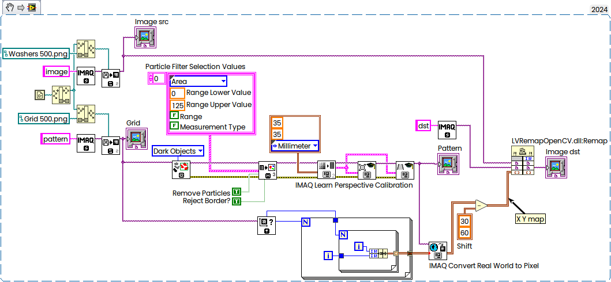

# LV_OpenCV_RemapDemo
Simple Demo — how to correct distortions with OpenCV Remap function
Based on NI example. x64 only.


Code behind:



When correction applied to the grid as well and with some manually placed ROIs:


C Code for Library Call:

```c
#include "opencv2/imgproc.hpp"
#include "vision/nivision.h"

using namespace cv;

typedef uintptr_t NIImageHandle;

//LabVIEW Array of Clusters:
typedef struct {
	float X;
	float Y;
} TD2;

typedef struct {
	int32_t dimSize;
	TD2 elt[1];
} TD1;
typedef TD1** TD1Hdl;

extern "C" int LV_SetThreadCore(int NumThreads);
extern "C" int LV_LVDTToGRImage(NIImageHandle niImageHandle, void* image);

extern "C" __declspec(dllexport) int Remap(NIImageHandle SrcImage, NIImageHandle DstImage, TD1Hdl XYmap)
{
	Image *ImgSrc, *ImgDst;
	unsigned char* LVImagePtrSrcU8, * LVImagePtrDstU8;
	int LVWidth, LVHeight;
	int LVLineWidthSrc, LVLineWidthDst;

	if (!SrcImage || !DstImage ) return ERR_NOT_IMAGE;

	LV_SetThreadCore(1); //must be called prior to LV_LVDTToGRImage
	LV_LVDTToGRImage(SrcImage, &ImgSrc);
	LV_LVDTToGRImage(DstImage, &ImgDst);
	if (!ImgSrc || !ImgDst) return ERR_NOT_IMAGE;

	LVWidth = ((ImageInfo*)ImgSrc)->xRes;
	LVHeight = ((ImageInfo*)ImgSrc)->yRes;
	imaqSetImageSize(ImgDst, LVWidth, LVHeight);

	LVLineWidthSrc = ((ImageInfo*)ImgSrc)->pixelsPerLine;
	LVLineWidthDst = ((ImageInfo*)ImgDst)->pixelsPerLine;

	LVImagePtrSrcU8 = (unsigned char*)((ImageInfo*)ImgSrc)->imageStart;
	LVImagePtrDstU8 = (unsigned char*)((ImageInfo*)ImgDst)->imageStart;
	if (!LVImagePtrSrcU8 || !LVImagePtrDstU8 ) return ERR_NULL_POINTER;

	Size size(LVWidth, LVHeight);
	Mat src(size, CV_8U, LVImagePtrSrcU8, LVLineWidthSrc);
	Mat dst(size, CV_8U, LVImagePtrDstU8, LVLineWidthDst);
	
	Mat map_x(src.size(), CV_32FC1);
	Mat map_y(src.size(), CV_32FC1);

	int rows = LVHeight; //amount of rows (map height)
	int cols = LVWidth; //amount of columns (map width)

	for (int row = 0; row < map_x.rows; row++) { //height, y
		for (int col = 0; col < map_x.cols; col++) { //width, x
			map_x.at<float>(row, col) = (float)((*XYmap)->elt)[col + row * map_x.cols].X;
			map_y.at<float>(row, col) = (float)((*XYmap)->elt)[col + row * map_x.cols].Y;
		}
	}
	//OpenCV Remap:
	remap(src, dst, map_x, map_y, INTER_LINEAR, BORDER_CONSTANT, Scalar(255));

    return 0;
}
```

